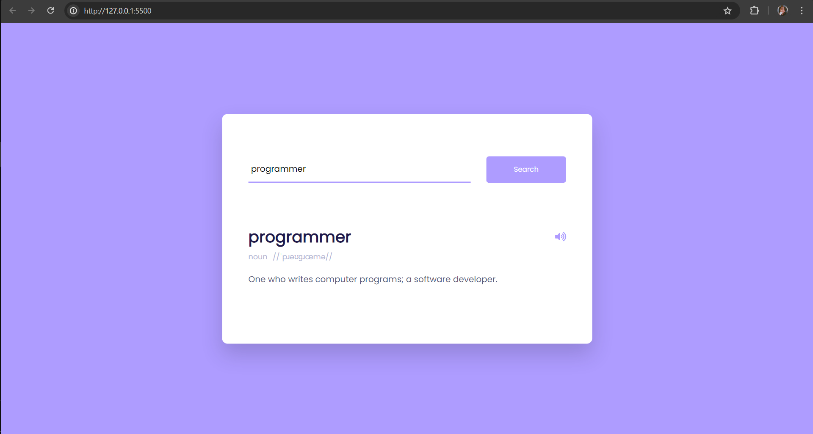

# WORDY
Wordy  houses a user-friendly dictionary application built with JavaScript that leverages the power of APIs to provide on-demand word definitions.

# Key Features:

1. Seamless Word Lookup: Effortlessly search for word meanings using a user-friendly interface.
2. API Integration: Employs a reputable dictionary API to deliver accurate and up-to-date definitions.

# Benefits:

* Enhance Vocabulary: Foster a love for language and expand your knowledge base with easy access to word meanings.
* Quick Reference Tool: Eliminate the need for bulky physical dictionaries; find definitions instantly.
* Developer-Friendly: Explore the codebase and learn how to integrate APIs in JavaScript projects.

# Getting Started:

- Clone the repository.
- Run the live server and start exploring the world of words!

